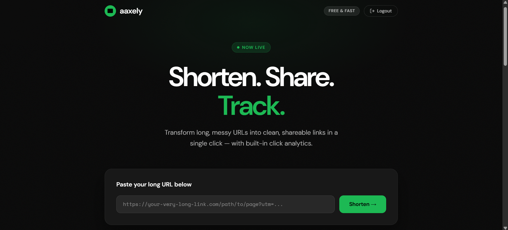
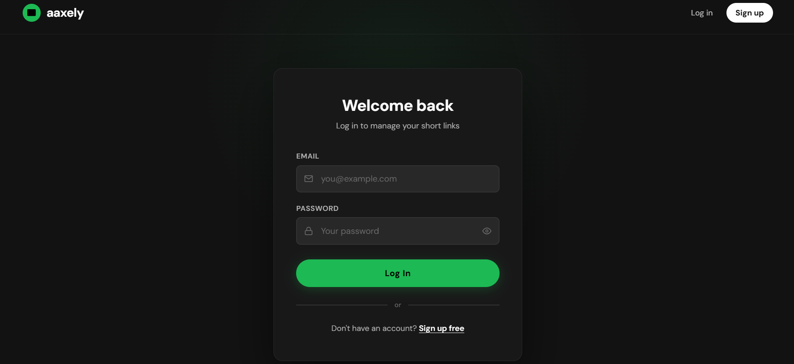
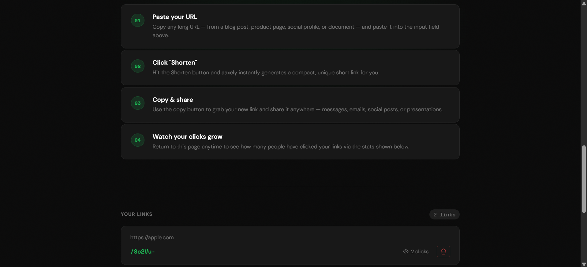
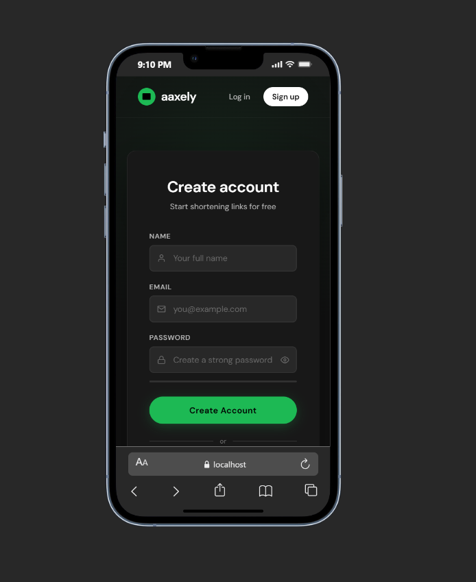

# aaxely — URL Shortener Service

> Shorten. Share. Track.

A full-stack URL shortening web application built with **Node.js**, **Express**, and **MongoDB**. Transform long, messy URLs into clean, shareable links — with built-in click analytics, JWT-based authentication, and a sleek dark-themed UI.


---

## Preview

| Landing & Shortener | Login |
|:---:|:---:|
|  |  |

| How it works & Link list | Mobile (Sign up) |
|:---:|:---:|
|  |  |

> Drop your screenshots into `docs/screenshots/` using the filenames above to render them here.

---

## Features

- 🔐 **JWT Authentication** — Sign up and log in with secure, cookie-based JWT sessions
- 🔗 **One-Click Shortening** — Generate compact, unique short IDs using `nanoid`
- 📊 **Click Tracking** — Every redirect increments a per-link click counter
- 👤 **Per-User Links** — Each user only sees and manages their own URLs
- 📝 **Request Logging** — Custom middleware logs every request to `logs.txt`
- 🎨 **Modern Dark UI** — Polished, responsive interface served via EJS templates
- ⚡ **Lightweight Stack** — No frontend framework needed; pure Express + EJS

---

## Tech Stack

| Layer | Technology |
|---|---|
| Runtime | Node.js |
| Web framework | Express 5 |
| Database | MongoDB + Mongoose |
| Templating | EJS |
| Auth | `jsonwebtoken`, `cookie-parser` |
| Short ID | `nanoid` |
| Config | `dotenv` |
| Dev tooling | `nodemon` |

---

## Getting Started

### Prerequisites

- **Node.js** v14 or higher
- **MongoDB** running locally, or a MongoDB Atlas connection string
- **npm** (ships with Node.js)

### Installation

```bash
# 1. Clone the repository
git clone https://github.com/<your-username>/urlShortnerService.git
cd urlShortnerService

# 2. Install dependencies
npm install
```

### Environment Variables

Create a `.env` file in the project root:

```env
PORT=8000
MONGO_URL=mongodb://127.0.0.1:27017/urlShortner
secretKey=replace-with-a-long-random-secret
```

| Variable | Description |
|---|---|
| `PORT` | Port the Express server listens on |
| `MONGO_URL` | MongoDB connection string (local or Atlas) |
| `secretKey` | Secret used to sign and verify JWTs |

### Running the App

```bash
# Development (auto-reload on changes)
npm run dev

# Production
npm start
```

Then open **http://localhost:8000** in your browser.

---

## Project Structure

```
urlShortnerService/
├── app.js                  # Application entry point
├── connection.js           # MongoDB connection helper
├── package.json
├── .env                    # Environment variables (not committed)
├── logs.txt                # Auto-generated request log
│
├── controllers/
│   ├── url.js              # Home, create short URL, redirect
│   └── users.js            # Signup & login handlers
│
├── middlewares/
│   ├── auth.js             # JWT cookie verification
│   └── logs.js             # Request logger to logs.txt
│
├── models/
│   ├── urlModel.js         # URL schema (originalUrl, shortId, totalClicks, createdBy)
│   └── users.js            # User schema (name, email, password)
│
├── routes/
│   ├── urlRouter.js        # /, /url, /url/:id
│   └── users.js            # /users/signup, /users/login
│
├── service/
│   └── auth.js             # createToken / verifyToken helpers
│
└── views/
    ├── home.ejs            # Dashboard + shortener form + link list
    ├── login.ejs
    └── signup.ejs
```

---

## API Endpoints

All non-`/users/*` routes are protected by the JWT middleware. Unauthenticated requests are redirected to the login page.

| Method | Endpoint | Auth | Description |
|---|---|:---:|---|
| `GET` | `/users/signup` | — | Render the signup page |
| `POST` | `/users/signup` | — | Create a new user, set JWT cookie, redirect to `/` |
| `GET` | `/users/login` | — | Render the login page |
| `POST` | `/users/login` | — | Validate credentials, set JWT cookie, redirect to `/` |
| `GET` | `/` | ✅ | Render the dashboard with the user's links |
| `POST` | `/url` | ✅ | Create a short URL from `originalUrl` in the request body |
| `GET` | `/url/:id` | ✅ | Look up `:id`, increment click count, 301-redirect to the original URL |

### Example: creating a short URL

```http
POST /url
Content-Type: application/x-www-form-urlencoded
Cookie: token=<jwt>

originalUrl=https://example.com/some/very/long/path
```

The dashboard re-renders with the new short ID (e.g. `/8c2Vu-`) appended to the user's link list.

---

## How It Works

1. **Sign up / Log in** — Credentials are validated against MongoDB; a JWT signed with `secretKey` is issued and stored in an HTTP cookie named `token`.
2. **Auth middleware** — On every protected request, `middlewares/auth.js` reads the cookie, verifies the JWT, and attaches the decoded user to `req.user`.
3. **Shorten** — `nanoid(6)` generates a unique 6-character ID, which is saved alongside the original URL and the user's `_id`.
4. **Redirect & track** — Visiting `/url/:id` looks up the document, increments `totalClicks`, and issues a 301 redirect to the original URL.
5. **Logging** — Every incoming request is appended to `logs.txt` by the custom logging middleware.

---


## Author

**Humayun Saghir**

If you find this project useful, consider giving it a ⭐ on GitHub!

---

## License

Released under the **ISC License**. See [`LICENSE`](LICENSE) for details.